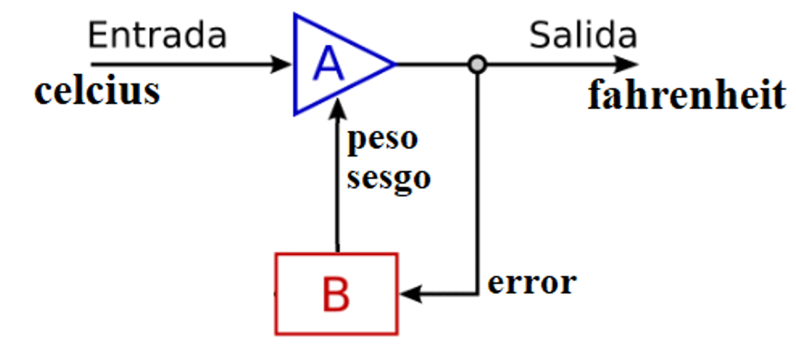

# aprendizaje-automatico
**¿Cómo es que las maquinas aprenden?**

Expone la respuesta como un aprendizaje automático (o machine learning) mediante la idea de una realimentación que minimiza el error de salida en cada iteración. La aplicación esta escrita en lenguaje **C#** y no utiliza librería alguna de IA (inteligencia artificial), solo código básico.

